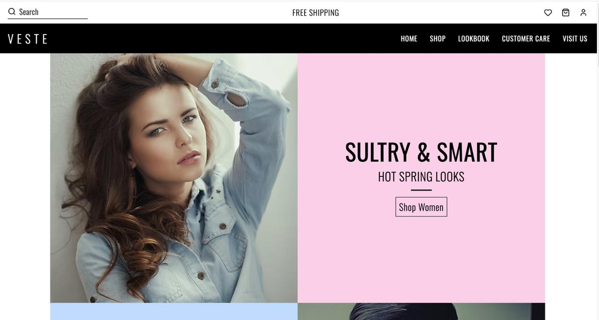
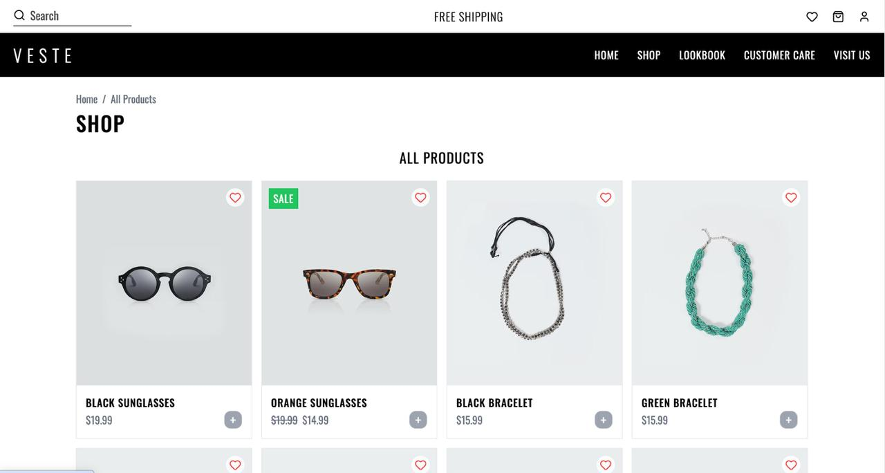
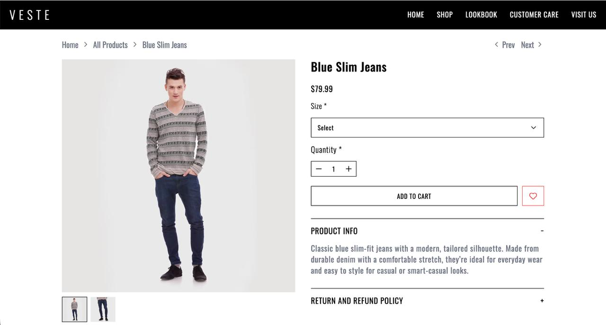
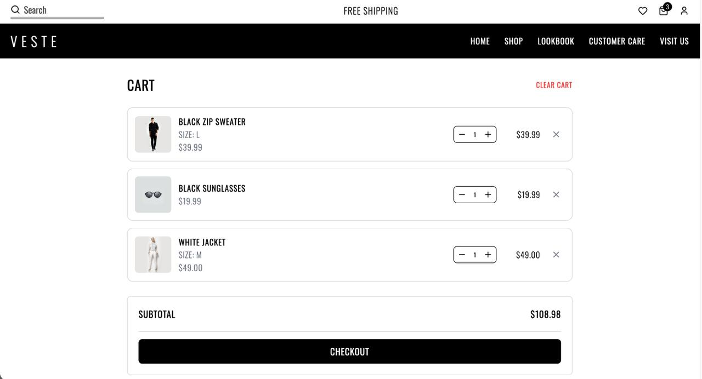
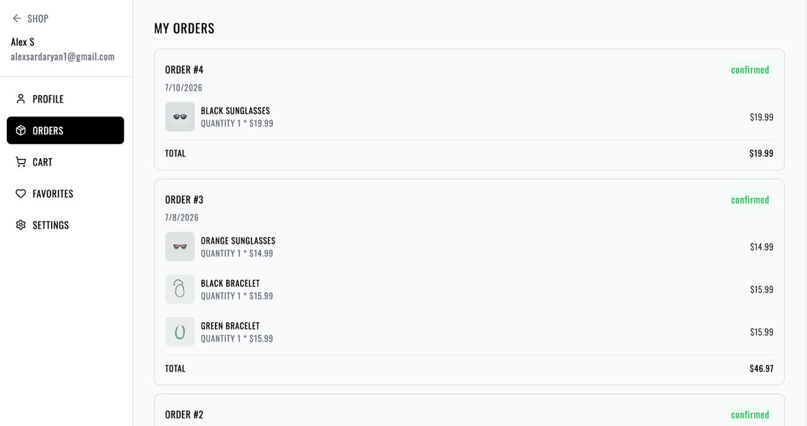
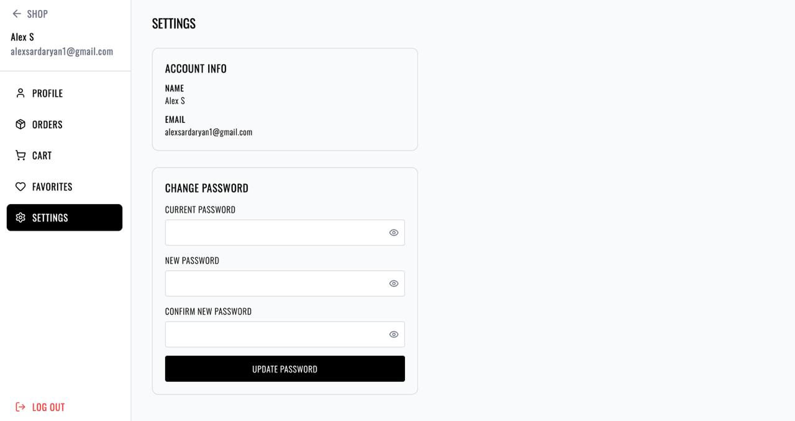
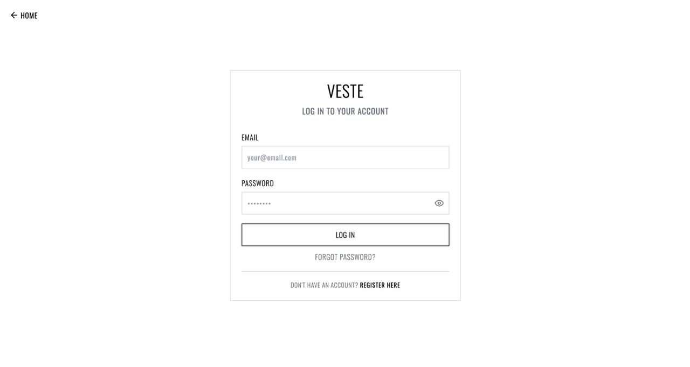
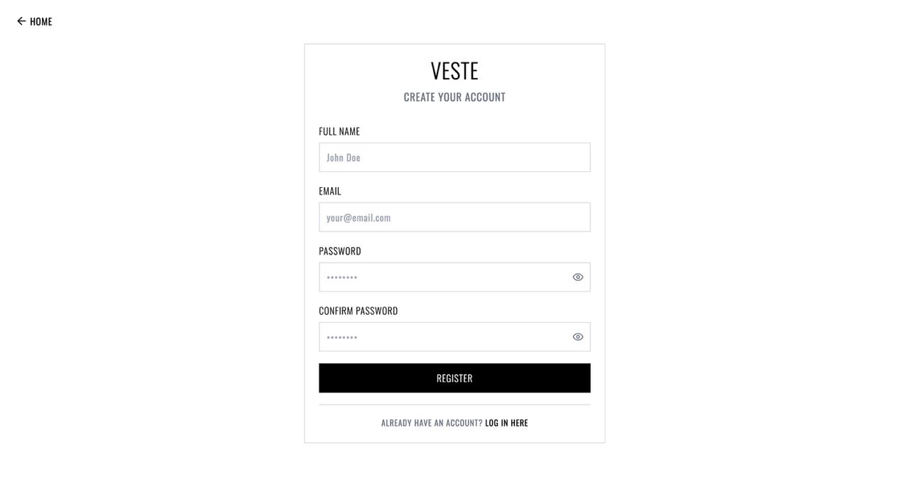

# Veste-Shop

A full-stack e-commerce clothing platform built with React, Node.js/Express, and PostgreSQL. Veste-Shop covers the complete flow of a modern online store — product browsing with fuzzy search, authentication, size-aware cart and wishlist management, checkout, and order history — with a fully responsive, custom-designed UI.

## Screenshots

### Homepage


### Shop


### Product Detail


### Cart


### Checkout


### Dashboard


### Dashboard


### Dashboard



## Live Demo

Coming soon.

## Tech Stack

**Frontend:** React (Vite), React Router, Tailwind CSS, Context API, Axios, Fuse.js, Lucide React

**Backend:** Node.js, Express, PostgreSQL (`pg`), JWT (HTTP-only cookies), Bcrypt, Nodemailer, Nodemon

**Architecture:** MVC on the backend (controllers, models, routes, middleware); Context-based global state on the frontend (Auth, Cart, Wishlist); mobile-first responsive design throughout

## Features

- **Authentication** — Register, email verification via one-time codes, login/logout, forgot/reset password, and in-account password change with current-password verification. Live client-side validation (email format, password strength checklist) mirrors backend rules exactly. Show/hide toggles on every password field.
- **Product Catalog** — Filterable, paginated product grid (category and sale filters), fuzzy search (typo-tolerant, powered by Fuse.js), and detailed product pages with an image gallery, size selection (skipped for accessories), quantity stepper with live running total, and Prev/Next navigation between products.
- **Size-Aware Cart** — The same product in two different sizes is tracked as two distinct cart lines. Cart state persists across page refreshes via `localStorage`. A mini-cart dropdown in the header auto-opens whenever an item is added, showing thumbnails, quantity controls, and a live subtotal. Sticky checkout bar on both mobile (full-width, fixed to the bottom) and desktop (sticky summary card) so checkout is always reachable without scrolling.
- **Wishlist** — Heart icon toggles state consistently across product cards, product detail pages, and a header badge count. Products that require a size can't be added to the cart directly from the wishlist — the user is guided back to the product page to make that selection, preventing a sizeless item from silently entering the cart.
- **Checkout & Orders** — A streamlined checkout screen (no redundant shipping form) listing cart contents with per-item and total pricing, plus Approve/Cancel actions. Approving creates a real order and order-items record in PostgreSQL. Order history in the dashboard shows full product details per order — images, names, quantities, prices — not just a count, and the profile page surfaces account-level order statistics (total orders, confirmed, pending, total spent).
- **User Dashboard** — Profile, Orders, Cart, Favorites, and Settings sections with a unified sidebar layout that adapts between mobile and desktop. Protected routes redirect unauthenticated users to login before they can add to cart, wishlist, or reach any dashboard page.
- **Responsive Design** — A single unified header component (not separate desktop/mobile files) handles both breakpoints, including a slide-out mobile nav with a "Shop" category accordion, mobile search bar toggle, and consistently aligned icon buttons. Built mobile-first entirely with Tailwind, with custom keyframe animations for interactive feedback (e.g. an "added to cart" pop effect).

## Technical Highlights

- Designed a normalized PostgreSQL schema from scratch — `users`, `products`, `product_images`, `product_variants`, `orders`, `order_items` — and wrote raw SQL queries across an MVC backend, including transactional order creation (`BEGIN`/`COMMIT`/`ROLLBACK`) to keep order and order-item inserts atomic.
- Implemented a complete JWT authentication flow with HTTP-only cookies, email verification, and secure password reset — including identifying and fixing a real bug where general user queries intentionally excluded the password hash (correct for most routes) but broke the "change password" flow, which needed a dedicated query that includes it.
- Built a size-aware shopping cart where quantity, removal, and updates are all keyed by `(productId, size)` rather than just `productId`, so a product in two sizes behaves as two independent line items throughout cart, mini-cart, and checkout.
- Added fuzzy product search (Fuse.js) so typos like "blause" still surface "Blouse" in results, instead of relying on exact substring matching.
- Refactored duplicated data-fetching logic (the product list was being fetched independently in two different components) into a shared `useProducts` hook to keep the two call sites in sync.
- Debugged and fixed a range of real-world issues: a zero-width flex container silently hiding item names on mobile, a validation function that always returned truthy due to comparing an object instead of its `.valid` property, and duplicate headers caused by leftover component code — the kind of bugs that only show up once an app is used beyond the happy path.

## Getting Started

### Prerequisites
- Node.js (v18+)
- PostgreSQL
- A Gmail account (or other SMTP provider) for transactional emails

### Installation

```bash
git clone https://github.com/<your-username>/veste-shop.git
cd veste-shop
```

**Backend:**
```bash
cd backend
npm install
```

Create a `.env` file in `backend/`:
```env
PORT=5001
NODE_ENV=development

DB_USER=your_postgres_user
DB_PASSWORD=your_postgres_password
DB_HOST=localhost
DB_PORT=5432
DB_NAME=veste_shop

JWT_SECRET=your_jwt_secret

EMAIL_USER=your_gmail_address
EMAIL_PASSWORD=your_gmail_app_password
```

Set up the PostgreSQL schema (`users`, `products`, `product_images`, `product_variants`, `orders`, `order_items`), then run:
```bash
npm run dev
```

**Frontend:**
```bash
cd ../frontend
npm install
npm run dev
```

Frontend runs on `http://localhost:5173`, backend on `http://localhost:5001`.

## Project Structure

```text
veste-shop/
├── frontend/
│   ├── src/
│   │   ├── components/    # Reusable UI components
│   │   ├── context/       # Global state management
│   │   ├── hooks/         # Custom React hooks
│   │   ├── pages/         # Application pages
│   │   ├── routes/        # React Router configuration
│   │   ├── services/      # Axios API client
│   │   ├── styles/        # Global styles
│   │   └── App.jsx
│   └── package.json
│
├── backend/
│   ├── src/
│   │   ├── config/        # Database and email configuration
│   │   ├── controllers/   # Business logic
│   │   ├── middleware/    # Authentication and validation
│   │   ├── models/        # PostgreSQL queries
│   │   ├── routes/        # API endpoints
│   │   ├── templates/     # Email templates
│   │   └── utils/         # Helper functions
│   ├── services/          # Email service
│   ├── server.js          # Express application entry point
│   └── package.json
│
└── README.md
```

## License

This project is for portfolio and educational purposes.
