# Veste-Shop

A full-stack e-commerce clothing platform built with React, Node.js/Express, and PostgreSQL. Veste-Shop covers the complete flow of a modern online store — product browsing with fuzzy search, authentication, size-aware cart and wishlist management, selective checkout, and order history — with a fully responsive, custom-designed UI.

## Screenshots

### Home-page

<table>
  <tr>
    <td>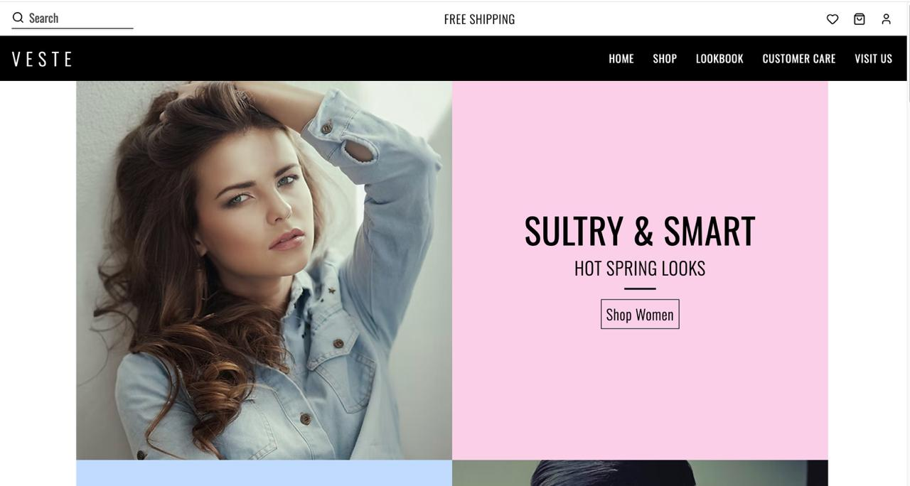</td>
    <td>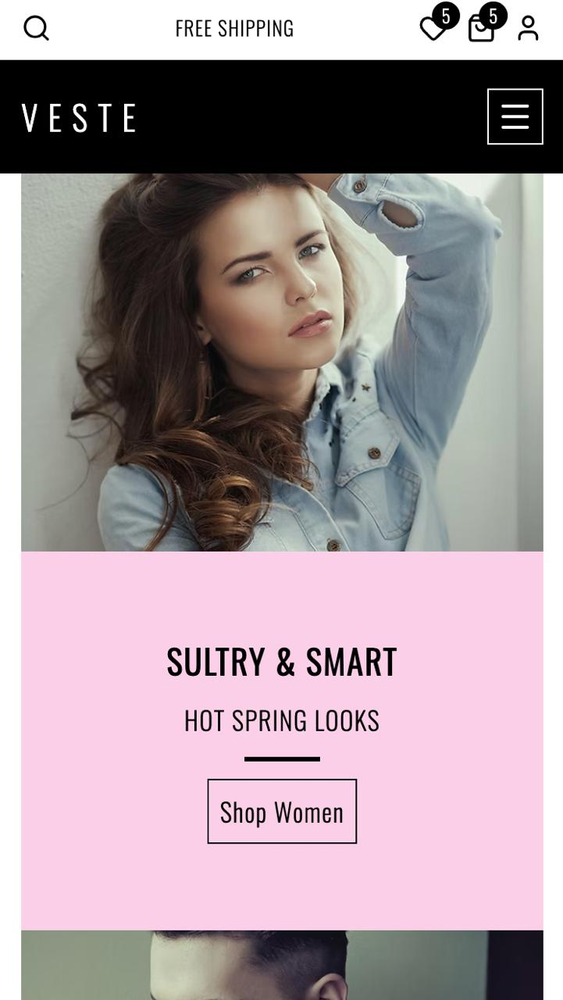</td>
  </tr>
</table>

### Shop-page

<table>
  <tr>
    <td>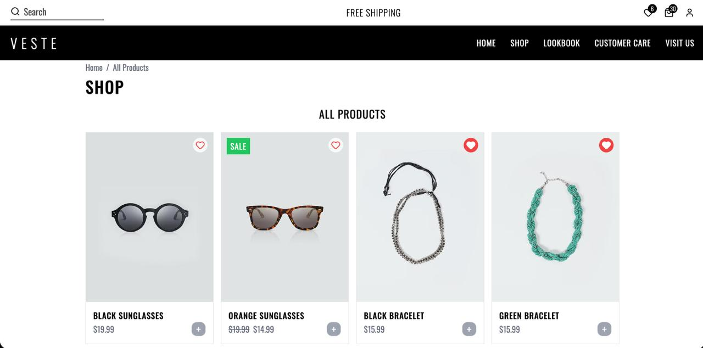</td>
    <td>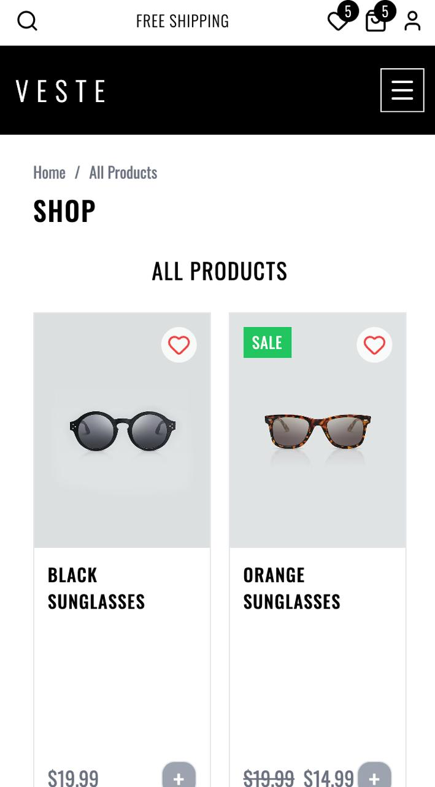</td>
  </tr>
</table>

### Checkout-page

<table>
  <tr>
    <td>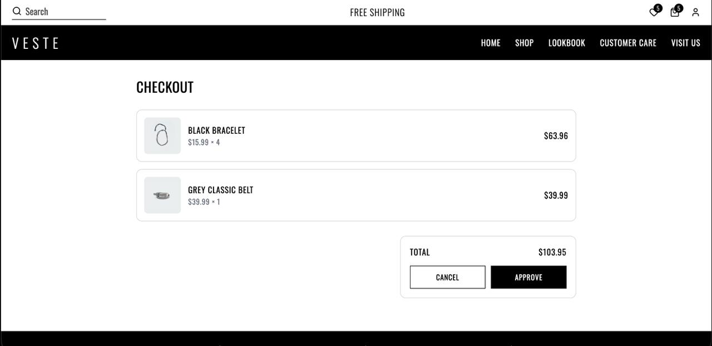</td>
    <td>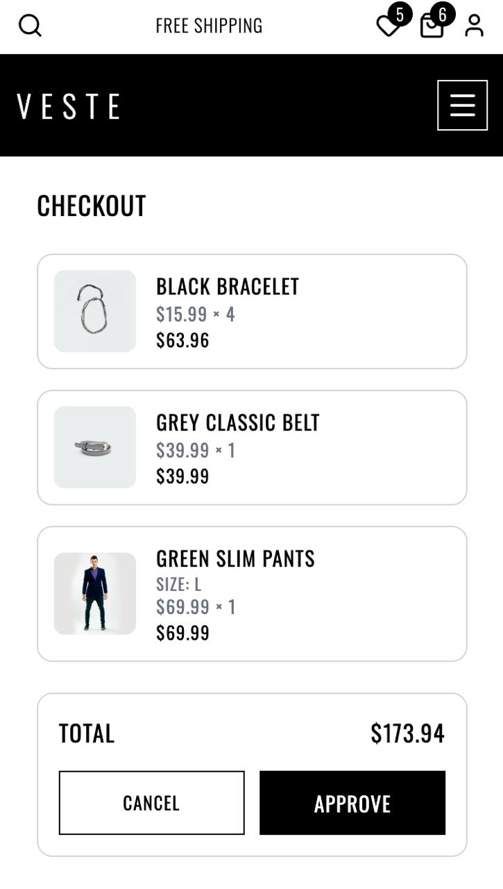</td>
  </tr>
</table>

### Product-Info-Page

<table>
  <tr>
    <td>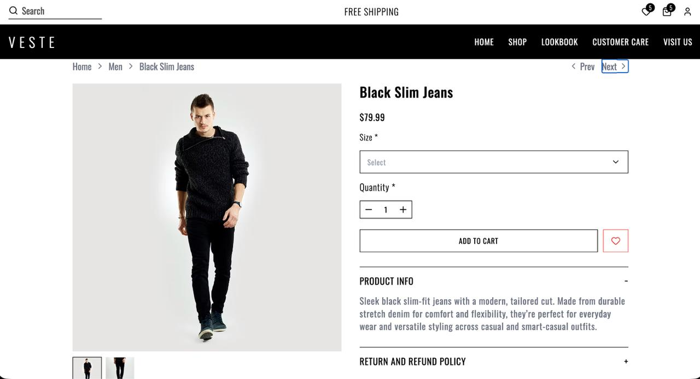</td>
    <td>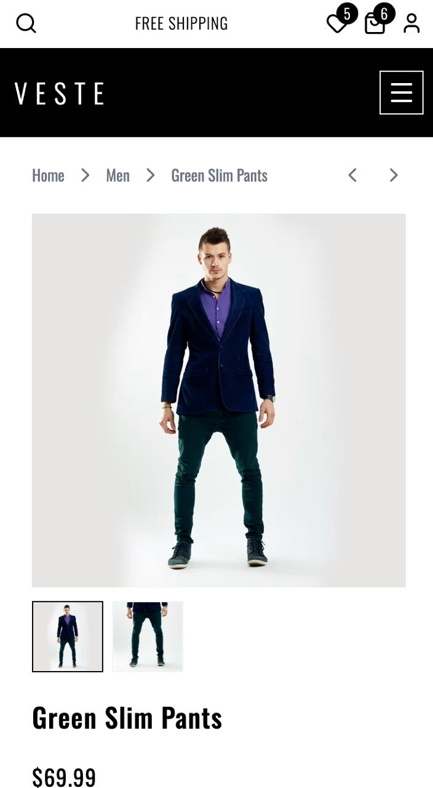</td>
  </tr>
</table>

### Cart-page

<table>
  <tr>
    <td>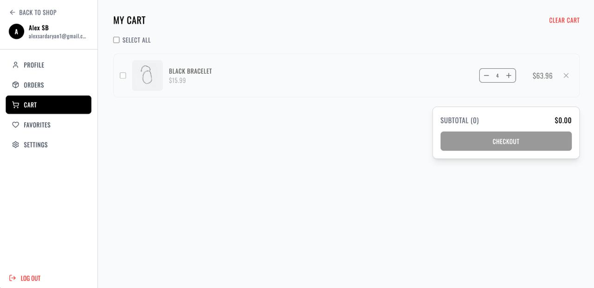</td>
    <td>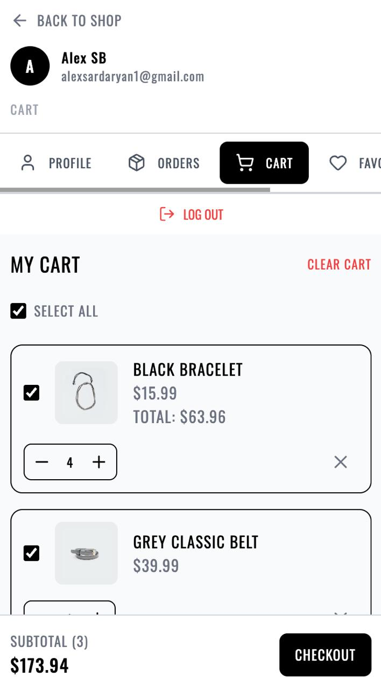</td>
  </tr>
</table>

### Orders-page

<table>
  <tr>
    <td>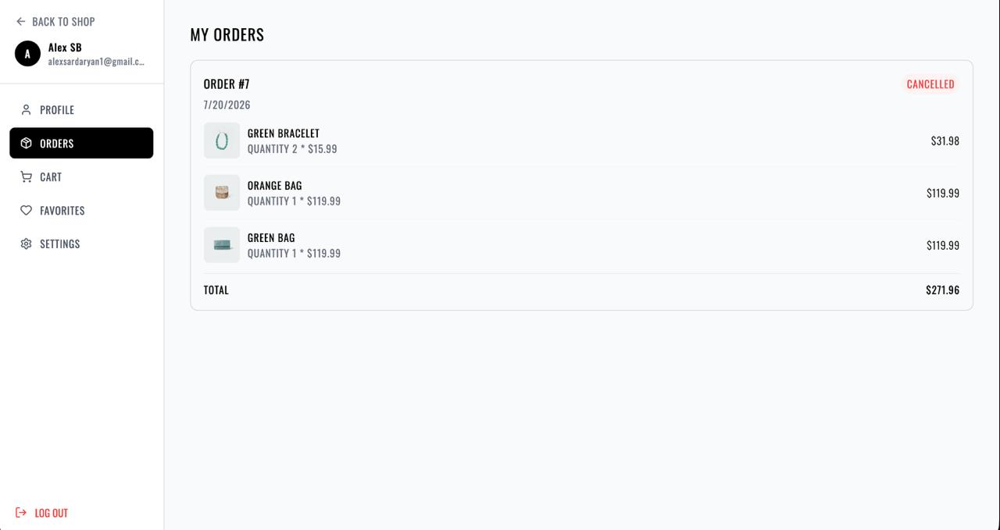</td>
    <td>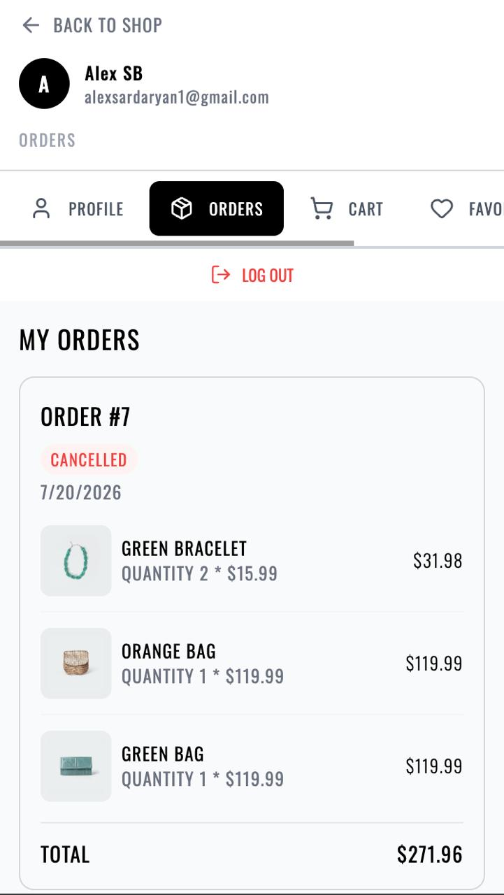</td>
  </tr>
</table>

### Dashboard-Settings-page

<table>
  <tr>
    <td>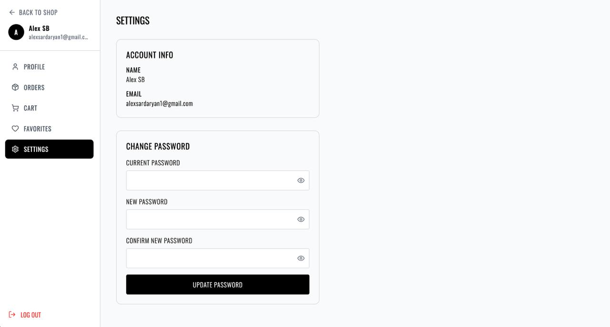</td>
    <td>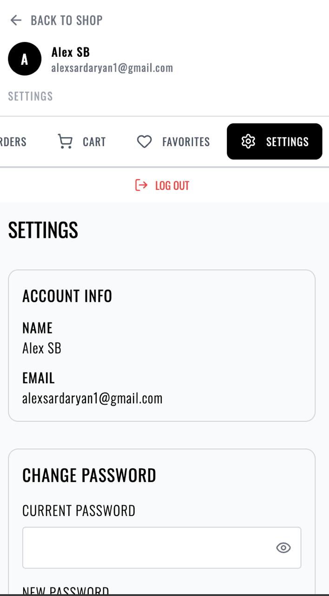</td>
  </tr>
</table>

### Register-page

<table>
  <tr>
    <td>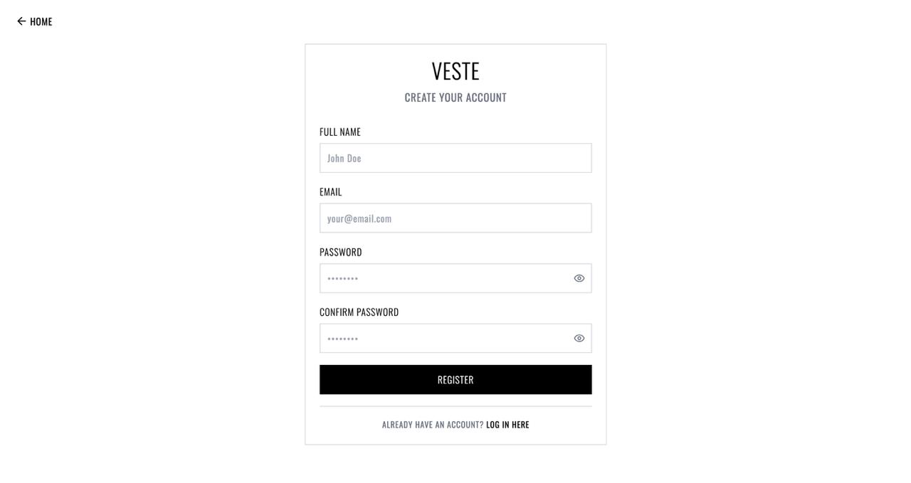</td>
    <td>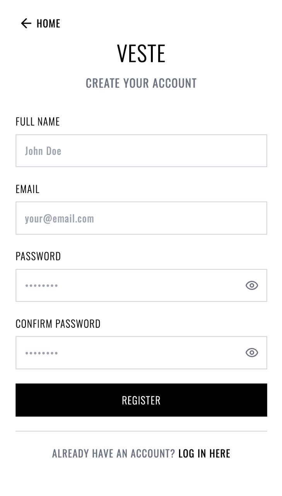</td>
  </tr>
</table>

### Login-page

<table>
  <tr>
    <td>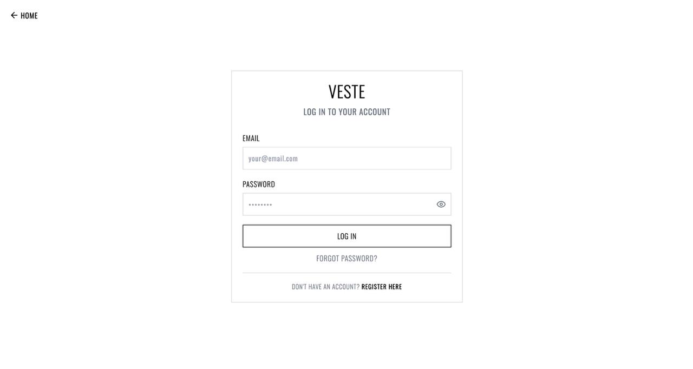</td>
    <td>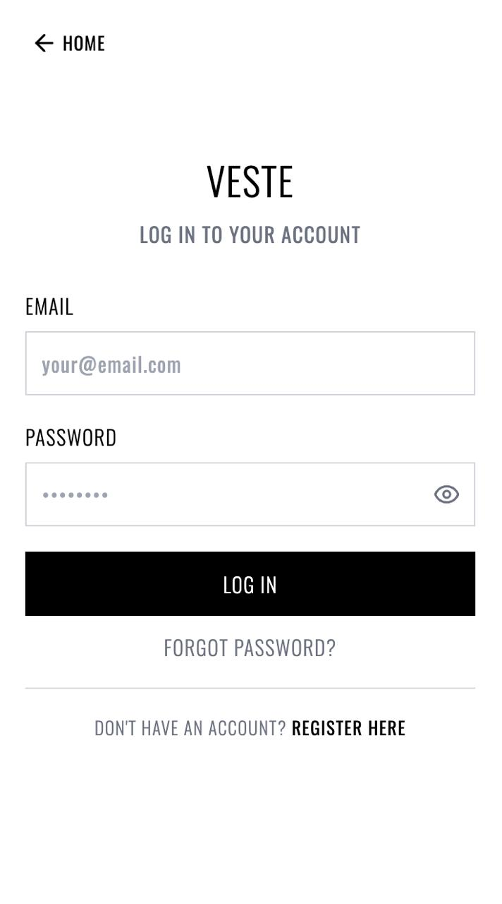</td>
  </tr>
</table>


## Live Demo

Coming soon.

## Tech Stack

**Frontend:** React (Vite), React Router, Tailwind CSS, Context API, Axios, Fuse.js, Lucide React

**Backend:** Node.js, Express, PostgreSQL (`pg`), JWT (HTTP-only cookies), Bcrypt, Nodemailer, Nodemon

**Architecture:** MVC on the backend (controllers, models, routes, middleware); Context-based global state on the frontend (Auth, Cart, Wishlist); mobile-first responsive design throughout

## Features

- **Authentication** — Register, email verification via one-time codes, login/logout, and a unified forgot-password flow: request a reset code, have it auto-verified inline as soon as it's entered (with live pass/fail feedback), then set a new password on the same screen without a page redirect. In-account password change with current-password verification. Live client-side validation (email format, password strength checklist) mirrors backend rules exactly, with show/hide toggles on every password field.
- **Product Catalog** — Filterable, paginated product grid (category and sale filters), fuzzy search (typo-tolerant, powered by Fuse.js), and detailed product pages with an image gallery, a custom dropdown for size selection (skipped for accessories) that opens beneath its trigger without ever clipping or covering content, a quantity stepper with live running total, and Prev/Next navigation between products with a breadcrumb that reflects the product's actual category.
- **Size-Aware, Per-User Cart** — The same product in two different sizes is tracked as two distinct cart lines. Cart and wishlist are both scoped per logged-in user (and separately for guests) via namespaced `localStorage` keys, so logging out and a different user logging in never leaks one person's cart or wishlist into another's session. Selective checkout lets the user check exactly which cart items to pay for in a single order — unchecked items stay safely in the cart. Adding an item gives instant inline visual feedback (a brief green checkmark state on the button) rather than interrupting the shopping flow.
- **Wishlist** — Heart icon toggles state consistently across product cards, product detail pages, and a header badge count. Products that require a size can't be added to the cart directly from the wishlist — the user is guided back to the product page to make that selection, preventing a sizeless item from silently entering the cart. Favorites can be filtered by category with a one-click "Clear Filters" reset.
- **Checkout & Orders** — A streamlined checkout screen (no redundant shipping form) listing only the items the user selected for that order, with per-item and total pricing, plus Approve/Cancel actions. Approving creates a real order and order-items record in PostgreSQL and removes just the purchased items from the cart. Order history in the dashboard shows full product details per order — images, names, quantities, prices — not just a count, supports one-click order cancellation while an order is still pending, and the profile page surfaces account-level order statistics (total orders, confirmed, pending, total spent).
- **User Dashboard** — Profile, Orders, Cart, Favorites, and Settings sections with a unified sidebar layout that stays pinned to the viewport height (independent of how much content is in the main panel) so navigation and logout are always reachable, regardless of screen size. Protected routes redirect unauthenticated users to login before they can add to cart, wishlist, or reach any dashboard page.
- **Responsive Design** — A single unified header component (not separate desktop/mobile files) handles both breakpoints, with its real rendered height tracked dynamically via a CSS custom property so page content and overlays always align correctly beneath it. Includes a slide-out mobile nav with a "Shop" category accordion, mobile search bar toggle, and consistently aligned icon buttons across all screen sizes. Built mobile-first entirely with Tailwind, with custom keyframe animations and inline success states for interactive feedback.

## Technical Highlights

- Designed a normalized PostgreSQL schema from scratch — `users`, `products`, `product_images`, `product_variants`, `orders`, `order_items` — and wrote raw SQL queries across an MVC backend, including transactional order creation (`BEGIN`/`COMMIT`/`ROLLBACK`) to keep order and order-item inserts atomic.
- Implemented a complete JWT authentication flow with HTTP-only cookies, email verification, and secure password reset — including identifying and fixing a real bug where general user queries intentionally excluded the password hash (correct for most routes) but broke the "change password" flow, which needed a dedicated query that includes it.
- Built a size-aware shopping cart where quantity, removal, and updates are all keyed by `(productId, size)` rather than just `productId`, so a product in two sizes behaves as two independent line items throughout cart and checkout.
- Scoped both cart and wishlist state per authenticated user by namespacing their `localStorage` keys with the current user's ID (falling back to a shared guest key when logged out), and synced that state to reload automatically whenever the logged-in user changes — closing a real cross-account data leak where one user's cart/wishlist was visible to the next person who logged in on the same device.
- Replaced native `<select>` elements for size selection with a fully custom dropdown (trigger button + absolutely positioned option list, closes on outside click) to get consistent cross-browser rendering and guarantee the option list always appears below its trigger without being clipped by a parent's `overflow-hidden`.
- Added fuzzy product search (Fuse.js) so typos like "blause" still surface "Blouse" in results, instead of relying on exact substring matching.
- Refactored duplicated data-fetching logic (the product list was being fetched independently in two different components) into a shared `useProducts` hook to keep the two call sites in sync.
- Debugged and fixed a range of real-world issues: a zero-width flex container silently hiding item names on mobile, a validation function that always returned truthy due to comparing an object instead of its `.valid` property, duplicate headers caused by leftover component code, a flexbox stretch issue that pushed the dashboard's logout button off-screen once the main content grew taller than the viewport, and SQL queries that used double quotes for string literals instead of single quotes, causing Postgres to misinterpret values like `'confirmed'` as column identifiers — the kind of bugs that only show up once an app is used beyond the happy path.

## Getting Started

### Prerequisites
- Node.js (v18+)
- PostgreSQL
- A Gmail account (or other SMTP provider) for transactional emails

### Installation

```bash
git clone https://github.com/<your-username>/veste-shop.git
cd veste-shop
```

**Backend:**
```bash
cd backend
npm install
```

Create a `.env` file in `backend/`:
```env
PORT=5001
NODE_ENV=development

DB_USER=your_postgres_user
DB_PASSWORD=your_postgres_password
DB_HOST=localhost
DB_PORT=5432
DB_NAME=veste_shop

JWT_SECRET=your_jwt_secret

EMAIL_USER=your_gmail_address
EMAIL_PASSWORD=your_gmail_app_password
```

Set up the PostgreSQL schema (`users`, `products`, `product_images`, `product_variants`, `orders`, `order_items`), then run:
```bash
npm run dev
```

**Frontend:**
```bash
cd ../frontend
npm install
npm run dev
```

Frontend runs on `http://localhost:5173`, backend on `http://localhost:5001`.

## Project Structure

```text
veste-shop/
├── frontend/
│   ├── src/
│   │   ├── components/    # Reusable UI components
│   │   ├── context/       # Global state management
│   │   ├── hooks/         # Custom React hooks
│   │   ├── pages/         # Application pages
│   │   ├── routes/        # React Router configuration
│   │   ├── services/      # Axios API client
│   │   ├── styles/        # Global styles
│   │   └── App.jsx
│   └── package.json
│
├── backend/
│   ├── src/
│   │   ├── config/        # Database and email configuration
│   │   ├── controllers/   # Business logic
│   │   ├── middleware/    # Authentication and validation
│   │   ├── models/        # PostgreSQL queries
│   │   ├── routes/        # API endpoints
│   │   ├── templates/     # Email templates
│   │   └── utils/         # Helper functions
│   ├── services/          # Email service
│   ├── server.js          # Express application entry point
│   └── package.json
│
└── README.md
```

## License

This project is for portfolio and educational purposes.